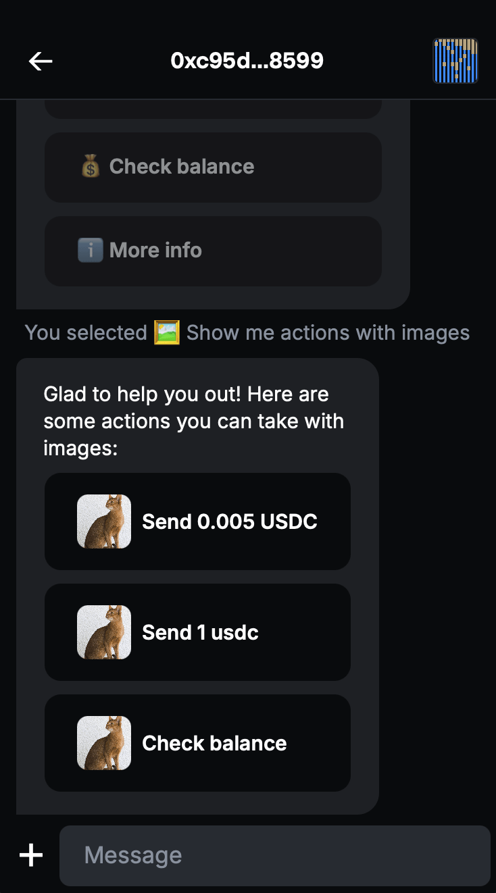

# Inline-actions example

An XMTP agent demonstrating wallet send calls, transaction references, and interactive inline actions using EIP-5792 and XIP-67 standards.

<p align="center">
  
  
</p>

## Getting started

> [!TIP]
> See XMTP's [cursor rules](/.cursor/README.md) for vibe coding agents and best practices.

## Commands

| Command                  | Description                      |
| ------------------------ | -------------------------------- |
| `/help`                  | Show interactive welcome actions |
| `/send <AMOUNT> <TOKEN>` | Send tokens to bot               |
| `/balance <TOKEN>`       | Check bot's balance              |
| `/info`                  | Show network info                |
| `/actions`               | Display action buttons           |

### Features

- Multi-token support (ETH, USDC)
- Multi-network support (Base, Ethereum)
- Wallet send calls (EIP-5792)
- Transaction references with metadata
- Interactive inline actions (XIP-67)
- Intent handling for button responses

#### Networks & Tokens

| Network          | Chain ID | Tokens    |
| ---------------- | -------- | --------- |
| Base Sepolia     | 84532    | ETH, USDC |
| Base Mainnet     | 8453     | ETH, USDC |
| Ethereum Sepolia | 11155111 | ETH       |
| Ethereum Mainnet | 1        | ETH, USDC |

- Faucets: [Circle](https://faucet.circle.com), [Base](https://portal.cdp.coinbase.com/products/faucet)

## Usage

Edit `handlers/actionHandlers.ts`:

```typescript
export async function handleActionsCommand(conversation: any) {
  const actionsContent: ActionsContent = {
    id: `help-${Date.now()}`,
    description: "Choose an action:",
    actions: [
      {
        id: "my-action",
        label: "My Action",
        style: "primary",
      },
    ],
  };
  await conversation.send(actionsContent, ContentTypeActions);
}
```

### Requirements

- Node.js v20 or higher
- Yarn v4 or higher
- Docker (optional, for local network)

### Environment variables

To run your XMTP agent, you must create a `.env` file with the following variables:

```bash
WALLET_KEY= # the private key of the wallet
DB_ENCRYPTION_KEY= # encryption key for the local database
XMTP_ENV=dev # local, dev, production
NETWORK_ID=base-sepolia # base-mainnet or others
```

You can generate random xmtp keys with the following command:

```bash
yarn gen:keys
```

> [!WARNING]
> Running the `gen:keys` command will append keys to your existing `.env` file.

### Run the agent

```bash
# git clone repo
git clone https://github.com/ephemeraHQ/xmtp-agent-examples.git
# go to the folder
cd xmtp-agent-examples
cd examples/xmtp-inline-actions
# install packages
yarn
# generate random xmtp keys (optional)
yarn gen:keys
# run the example
yarn dev
```

## Reference

This example is based on the [TBA Chat Example Bot](https://github.com/siwan-cb/tba-chat-example-bot).
